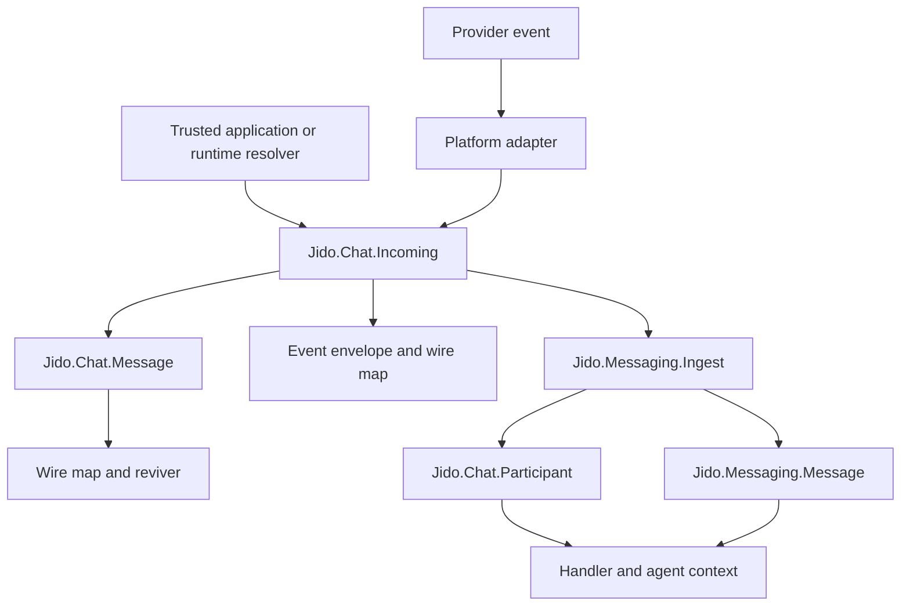
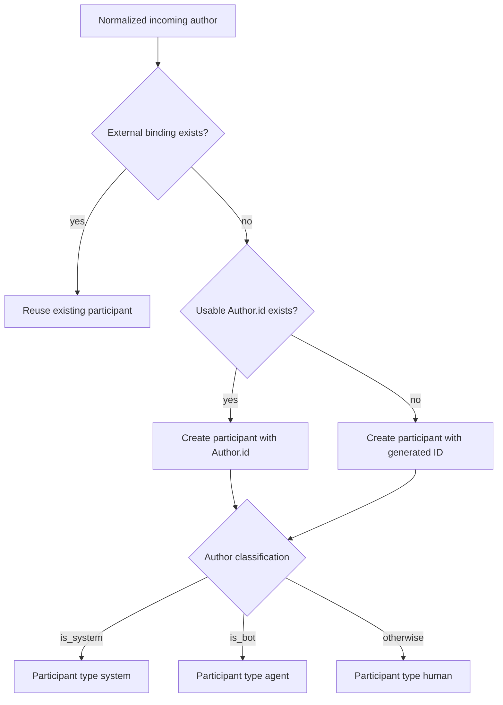
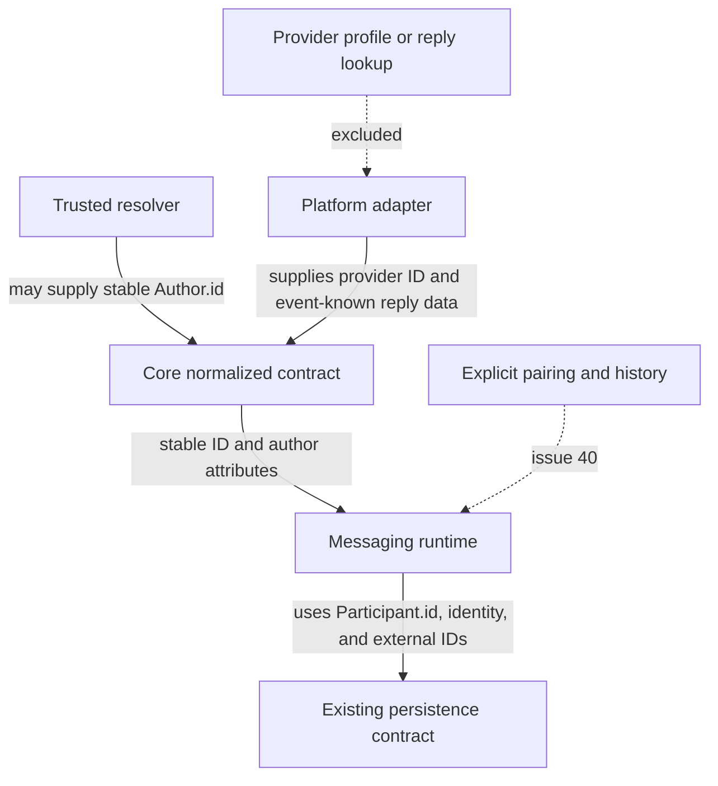

# Stable Author and Reply Context - Plan

## Current Status

This file is a dated record of the plan that was ready for implementation on
2026-08-20. It is not a list of open work.

| Scope | Result |
|---|---|
| Core units U1-U3 | Merged in [`agentjido/jido_chat` PR #46](https://github.com/agentjido/jido_chat/pull/46). |
| Runtime unit U4 | Merged in [`agentjido/jido_messaging` PR #71](https://github.com/agentjido/jido_messaging/pull/71). |
| Cross-package proof U5 | The validation records in PR #46 and PR #71 include isolated cross-package checks. |
| Parent issue | [Issue #36](https://github.com/agentjido/jido_chat/issues/36) is closed. |

Issues #38 and #40 are also closed. Before you use a deferred item, check the
current code and current issues in its repository. The `artifact_readiness`
value records the original state of this plan. All present-tense statements
below describe the repository state on 2026-08-20, before the linked pull
requests merged.

## Goal Capsule

| Item | Contract |
|---|---|
| Objective | Preserve stable author identity and shallow reply context across the core chat contract and the messaging runtime. |
| Authority | GitHub issue 36 defines product scope. This plan defines implementation. GitHub issue 40 owns participant pairing and cross-platform history. |
| Execution profile | Make the public contract changes in `agentjido/jido_chat`, then update `agentjido/jido_messaging`, then prove the combined flow in `agentjido/jido_chat_integration`. |
| Stop conditions | Stop if the work needs automatic participant pairing, a provider profile call, a recursive reply payload, or a change to existing external bindings. |
| Tail ownership | Land and release the core contract before the runtime dependency update. Keep each repository in its own focused change. |

---

## Product Contract

### Summary

Add optional stable identity, email, and system state to the normalized author. Add one-level reply context to normalized incoming messages and messages. Preserve these values through conversion, wire revival, and the existing `Jido.Chat.Participant` model without adding another identity system.

### Problem Frame

`Jido.Chat.Author` has provider identity and bot state, but it has no framework-neutral stable identity, email, or system-author state. `Jido.Chat.Incoming` already accepts an external reply ID, but `Jido.Chat.Message.from_incoming/2` drops it and has no normalized reply snapshot. These gaps remove useful context at adapter and runtime boundaries.

`Jido.Chat.Participant` already owns the stable internal ID, identity map, and provider external IDs. `Jido.Messaging.Message` already owns internal and external reply IDs. The change must extend these contracts instead of creating parallel identity or reply systems.

### Actors

- A1. A platform adapter supplies provider identity and reply data that the provider event already contains.
- A2. A trusted application or runtime resolver supplies a stable author identity when it knows one.
- A3. A chat or agent consumer reads normalized author and reply context without a provider lookup.
- A4. `jido_messaging` resolves the author to the existing participant and message contracts.

### Requirements

#### Author identity

- R1. `Jido.Chat.Author` accepts optional string `id` and `email` fields and a boolean `is_system` field from atom-key and string-key maps. `is_system` defaults to false.
- R2. `Author.id` is the framework-neutral stable identity, while `Author.user_id` remains the provider user identity.
- R3. The new author fields are optional, and old author maps keep their current defaults and validation rules.
- R4. Manual event-user normalization preserves stable identity, email, system state, bot state, names, and author metadata.

#### Reply context

- R5. `Jido.Chat.Incoming` and `Jido.Chat.Message` accept an optional typed, one-level reply snapshot with the fields `id`, `external_message_id`, `text`, and `author`.
- R6. `Jido.Chat.Message` accepts the optional external replied-to ID that already exists on `Jido.Chat.Incoming`.
- R7. `Message.from_incoming/2` preserves the external replied-to ID and the reply snapshot without a provider lookup.
- R8. The transport reply ID and the reply snapshot ID remain independent when they disagree.

#### Wire and runtime boundaries

- R9. Enriched authors, reply IDs, and reply snapshots survive `to_map/1`, `from_map/1`, event-envelope serialization, and `Jido.Chat` revival.
- R10. A supplied `Author.id` seeds `Jido.Chat.Participant.id` when `jido_messaging` creates a participant for an unbound external identity.
- R11. Participant identity keeps author email and names. Participant type is `:system` for a system author, `:agent` for a bot author, and `:human` otherwise.
- R12. `Jido.Messaging.Message.sender_id` and the participant ID in runtime context use the resolved participant ID without conversion loss.
- R13. When stable identity is missing or blank, participant resolution uses the current generated ID and external-identity binding path.
- R14. An existing external binding remains authoritative and is not silently rebound when later input supplies a different stable identity.
- R15. Runtime ingest continues to preserve both `Jido.Messaging.Message.reply_to_id` and `external_reply_to_id`.

#### Agent context, compatibility, and ownership

- R16. `Jido.Chat.AI` maps a system author to the system role after it checks an explicit message role and before it checks `is_me`.
- R17. Reply snapshots, email, and stable identity do not enter AI prompt content automatically.
- R18. Existing messages, serialized maps, and adapter payloads without the new fields remain source compatible.
- R19. Platform adapters do not infer stable identity from provider IDs, display names, user names, or email.
- R20. Documentation states that a trusted application or runtime resolver owns stable identity resolution.

### Key Flows

- F1. Enriched inbound author
  - **Trigger:** An adapter or application creates a normalized incoming message.
  - **Actors:** A1, A2, A3
  - **Steps:** Normalize the author, preserve it in the message, serialize it, and revive it.
  - **Outcome:** The consumer receives the same stable identity, email, system state, and provider identity.
  - **Covered by:** R1-R4, R9, R18-R20
- F2. Reply preservation
  - **Trigger:** An inbound event contains a replied-to ID or shallow reply data.
  - **Actors:** A1, A3
  - **Steps:** Normalize the snapshot, convert the incoming value to a message, and cross the wire boundary.
  - **Outcome:** The external reply ID and available reply context remain accessible without another provider call.
  - **Covered by:** R5-R9, R17-R19
- F3. Participant resolution
  - **Trigger:** `jido_messaging` ingests a normalized incoming message.
  - **Actors:** A2, A4
  - **Steps:** Resolve the external binding, seed a new participant from the author when needed, and build runtime message and context data.
  - **Outcome:** Stable identity reaches participant, sender, and context IDs. Legacy input keeps the current path.
  - **Covered by:** R10-R15, R18-R20

### Acceptance Examples

- AE1. **Covers R1-R3.** Given an atom-key human author with stable identity and email, when it is normalized, then all values remain and both status flags default to false.
- AE2. **Covers R1-R4.** Given a string-key bot or system author, when it enters through `Incoming` or an event-user path, then no enriched author field is lost.
- AE3. **Covers R5-R8.** Given an incoming reply with an external ID and a one-level snapshot, when `Message.from_incoming/2` runs, then both values remain independent.
- AE4. **Covers R5 and R9.** Given a reply snapshot that contains nested reply data, when it is normalized and serialized, then only one snapshot level remains.
- AE5. **Covers R9 and R18.** Given an enriched incoming message or message, when it is serialized and revived from string-key wire data, then the author and reply structs are restored.
- AE6. **Covers R10-R12.** Given a stable human, bot, or system author on an unbound external identity, when runtime ingest resolves the participant, then the stable ID becomes the participant, sender, and context ID and the type matches the author.
- AE7. **Covers R13.** Given an author without a usable stable identity, when runtime ingest resolves the participant, then it generates an ID and reuses it for later messages on the same external binding.
- AE8. **Covers R14.** Given an existing external binding and later input with a different stable identity, when runtime ingest resolves the participant, then it keeps the existing binding and does not merge identities.
- AE9. **Covers R15.** Given a reply whose external parent resolves to a stored runtime message, when runtime ingest persists it, then the runtime message contains both internal and external reply IDs.
- AE10. **Covers R16-R17.** Given a system author, when AI conversion runs, then it produces a system role unless explicit message metadata selects another supported role and it does not add author or reply data to content.
- AE11. **Covers R18-R20.** Given an unchanged adapter payload with no new fields, when it passes through the core and runtime, then normalization and ingest continue to succeed without provider calls.

### Scope Boundaries

#### In scope

- Core author, incoming message, normalized message, event-user, AI role, serialization, and revival contracts.
- Runtime participant mapping and existing reply-ID preservation.
- Cross-package compatibility tests and ownership documentation.

#### Deferred to Follow-Up Work at Plan Time

At the time of this plan:

- Cross-platform participant pairing, rebinding, collision handling, and participant-scoped history belonged to [issue 40](https://github.com/agentjido/jido_chat/issues/40).
- User lookup and provider-backed participant contracts belonged to [issue 38](https://github.com/agentjido/jido_chat/issues/38).

#### Outside this plan

- Transcript storage or a second message store.
- Automatic identity merge from display name, user name, email, or provider ID.
- Provider API calls for profiles or replied-to messages.
- Adapter-specific feature changes or new adapter callbacks.
- Persistence of the shallow core reply snapshot on `Jido.Messaging.Message`.
- A change to the current inbound `Jido.Messaging.Message.role` value.

---

## Planning Contract

### Key Technical Decisions

- KTD1. **Use `Author.id` for stable identity.** Keep `user_id` as the provider ID and use the optional `id` field to align directly with `Participant.id`. (session-settled: user-approved — chosen over message-level identity: participant identity belongs to the author, not to each message.)
- KTD2. **Add a typed one-level `ReplyContext`.** The snapshot contains optional `id`, `external_message_id`, `text`, and `author` fields. It excludes raw payload, attachments, metadata, and another reply snapshot. (session-settled: user-approved — chosen over recursive message embedding: a shallow snapshot avoids cycles and uncontrolled wire growth.)
- KTD3. **Keep adapter changes out of the feature.** Core accepts known values and old payloads. Adapter repositories do not gain provider lookups or identity inference. (session-settled: user-approved — chosen over broad adapter feature work: issue 36 changes the shared contract and runtime mapping.)
- KTD4. **Reuse participant creation and external binding.** `jido_messaging` seeds a new participant with `Author.id` and author attributes. It keeps persistence callbacks and existing bindings unchanged. Issue 40 owns pairing and rebinding.
- KTD5. **Classify participants, not runtime message roles.** Use system before bot before human for `Participant.type`. Keep inbound runtime messages at `role: :user` to avoid an unrelated behavior change.
- KTD6. **Keep AI role precedence explicit.** The order is message metadata, system author, `is_me`, then user. This keeps current overrides and adds a useful system-author result.
- KTD7. **Make the reply type independently revivable.** Give `ReplyContext` the same public Zoi, `to_map/1`, `from_map/1`, and type-marker pattern as other core value types. Parent revival must also rebuild it.
- KTD8. **Release the core contract first.** Use the integration repository's path dependencies for pre-release proof. After the core release, refresh the `jido_messaging` lock without adding a permanent path dependency.

### High-Level Technical Design

#### Contract propagation

#### Participant resolution

#### Ownership boundaries

### Sequencing

1. Add and verify the core author contract.
2. Add and verify reply context, conversion, and revival.
3. Document the core ownership rule and prove old adapter compatibility.
4. Update the runtime participant mapping against the sibling core source.
5. Run the cross-package integration proof with path dependencies.
6. Release the core contract, refresh the runtime dependency lock, and run the direct runtime gates.

### Deferred Implementation Notes

- Do not choose an automatic merge policy if a stable ID conflicts with an existing binding. Preserve the existing binding and leave explicit pairing to issue 40.
- Do not add reply snapshot fields to the runtime persistence model unless a separate requirement changes that scope.
- Do not add adapter-specific aliases for identity or reply data unless implementation finds a current core normalization loss.

---

## Implementation Units

### U1. Extend the normalized author contract

**Goal:** Add stable identity, email, and system state without changing legacy author construction.

**Requirements:** R1-R4, R16-R18; AE1, AE2, AE10

**Dependencies:** None

**Repository:** `agentjido/jido_chat`

**Files:**

- `lib/jido/chat/author.ex`
- `lib/jido/chat/event_normalizer.ex`
- `lib/jido/chat/ai.ex`
- `test/jido/chat/structs_test.exs`
- `test/jido/chat/event_envelope_test.exs`
- `test/jido/chat/ai_test.exs`

**Approach:**

1. Extend the Zoi author schema with the optional fields from KTD1.
2. Make `Incoming` and event-user normalization keep atom-key and string-key enriched author maps.
3. Copy all normalized author fields through the event alias path instead of rebuilding a lossy subset.
4. Add the AI role precedence from KTD6 without changing prompt content.

**Execution note:** Start with failing normalization and role tests because the current string-key author and event-user paths lose data.

**Patterns to follow:** Use the Zoi-backed value type pattern in `lib/jido/chat/author.ex` and the focused role tests in `test/jido/chat/ai_test.exs`.

**Test scenarios:**

1. Covers AE1. Normalize an atom-key human author with stable ID and email. Assert the new values and false status defaults.
2. Covers AE2. Normalize string-key bot and system authors. Assert stable ID, email, bot state, system state, names, and metadata.
3. Build `Incoming` with a string-key `author` and `external_user_id`. Assert the enriched author is not replaced by the legacy fallback.
4. Normalize an old author map. Assert current required fields and defaults are unchanged.
5. Covers AE2. Normalize an event user that uses provider aliases. Assert every enriched author field survives the event envelope path.
6. Covers AE10. Convert a system author with no role metadata. Assert the AI role is `system`.
7. Convert a system author with explicit user or assistant role metadata. Assert the explicit role wins.
8. Convert an author with both `is_system` and `is_me`. Assert system wins. Assert the old non-system `is_me` path remains assistant.

**Verification:** All author entry paths return the same enriched `Author` shape, and old author inputs have no behavior change.

### U2. Add shallow reply context and wire revival

**Goal:** Preserve reply identity and available quoted context across core conversion and wire boundaries.

**Requirements:** R5-R9, R17-R18; AE3-AE5

**Dependencies:** U1

**Repository:** `agentjido/jido_chat`

**Files:**

- `lib/jido/chat/reply_context.ex`
- `lib/jido/chat/incoming.ex`
- `lib/jido/chat/message.ex`
- `lib/jido/chat/serialization.ex`
- `test/jido/chat/structs_test.exs`
- `test/jido/chat/serialization_test.exs`

**Approach:**

1. Add the public Zoi-backed reply value type from KTD2 and KTD7.
2. Normalize reply maps from atom-key and string-key input on both parent types.
3. Add the external replied-to ID to `Message` and copy both reply values in `from_incoming/2`.
4. Keep transport and snapshot IDs independent. Do not synthesize one from the other.
5. Strip nested reply data by contract so snapshots cannot recurse.

**Execution note:** Start with the failing `Message.from_incoming/2` preservation case, then add round-trip coverage.

**Patterns to follow:** Mirror nested struct normalization in `lib/jido/chat/incoming.ex`, type markers in `lib/jido/chat/message.ex`, and dispatch in `lib/jido/chat/serialization.ex`.

**Test scenarios:**

1. Normalize atom-key and string-key reply maps. Assert a `ReplyContext` with optional message IDs, text, and author.
2. Covers AE3. Convert an incoming reply with an external ID and snapshot. Assert `Message` keeps both.
3. Convert a reply where the transport ID differs from the snapshot ID. Assert both original values remain.
4. Convert input with only an external reply ID. Assert no empty snapshot is invented.
5. Convert input with only a snapshot. Assert no external reply ID is invented.
6. Covers AE4. Normalize a snapshot that contains nested reply data. Assert the result and its wire map stay one level deep.
7. Covers AE5. Round-trip enriched `Incoming`, `Message`, and standalone `ReplyContext` maps. Assert all nested types revive.
8. Revive old incoming and message wire maps without the new fields. Assert the new fields are absent and old values remain.

**Verification:** Conversion and revival preserve all supplied reply fields, reject recursive shape growth, and accept old wire data.

### U3. Document ownership and prove adapter compatibility

**Goal:** State which layer owns stable identity and show that old adapter payloads need no changes.

**Requirements:** R18-R20; AE11

**Dependencies:** U1, U2

**Repository:** `agentjido/jido_chat`

**Files:**

- `README.md`
- `usage-rules.md`
- `test/jido/chat/adapter_conformance_test.exs`

**Approach:**

1. Add the stable identity rule to the adapter author guidance.
2. Distinguish stable `Author.id` from provider `Author.user_id`.
3. State that adapters may pass a stable identity only when a trusted upstream resolver supplied it.
4. Keep provider lookups and adapter callback changes outside the core contract.

**Patterns to follow:** Extend the current Adapter Author Checklist and package boundary text in `README.md` and `usage-rules.md`.

**Test scenarios:**

1. Covers AE11. Normalize a representative old adapter payload with no enriched author or reply fields. Assert the same `Incoming` and `Message` behavior.
2. Normalize a payload that already contains a trusted enriched author map. Assert the core keeps it without an adapter callback change.

**Verification:** Public guidance assigns stable identity to the trusted resolver, and conformance coverage shows that existing adapters remain valid.

### U4. Map normalized authors into runtime participants

**Goal:** Carry normalized author identity and classification into the existing participant, sender, and context IDs.

**Requirements:** R10-R15, R18-R20; AE6-AE9

**Dependencies:** U1 for implementation. A released `jido_chat` version that contains U1 is required only for the final direct runtime gates and lock update.

**Repository:** `agentjido/jido_messaging`

**Files:**

- `lib/jido_messaging/ingest.ex`
- `test/jido_messaging/ingest_test.exs`
- `test/jido_messaging/reply_mapping_test.exs`
- `README.md`
- `usage-rules.md`
- `mix.lock`

**Approach:**

1. Build participant attributes from normalized `Author`, with current top-level user fields as legacy fallbacks.
2. Use `incoming.external_user_id` or `Author.user_id` for the provider binding.
3. Seed `Participant.id` only when `Author.id` is non-blank and the external binding is unbound.
4. Map author names and email into `Participant.identity` and apply KTD5 type precedence.
5. Keep the existing get-or-create persistence callback and existing binding authority from KTD4.
6. Keep runtime message role unchanged and verify the existing internal and external reply IDs.
7. Refresh the dependency lock only after the new core release is available.

**Execution note:** Add ingest contract tests before changing resolution. Compile and test the runtime source through the integration repository's core override before release. After the core release, refresh the runtime lock and run the direct runtime gates. Do not add a permanent path dependency.

**Patterns to follow:** Extend `resolve_participant/3` in `lib/jido_messaging/ingest.ex`. Keep the current `get_or_create_participant_by_external_id/4` contract in ETS and SQLite.

**Test scenarios:**

1. Covers AE6. Ingest a stable human author. Assert exact participant, sender, and context IDs and complete identity data.
2. Ingest a stable bot author. Assert participant type `:agent` and runtime message role `:user`.
3. Ingest an author with both bot and system state. Assert participant type `:system` and runtime message role `:user`.
4. Covers AE7. Ingest missing, nil, and blank stable identities. Assert a generated non-empty ID and external binding reuse.
5. Ingest legacy top-level user fields without an author. Assert current participant data and reuse behavior.
6. Covers AE8. Ingest a second message for an existing external binding with a different stable ID or type. Assert the original participant remains authoritative.
7. Ingest two unresolved authors with equal display names and different external IDs. Assert they do not merge.
8. Covers AE9. Ingest a resolvable reply. Assert both internal and external reply IDs on the persisted runtime message.
9. Ingest an unresolved reply ID. Assert the external ID remains and the internal reply ID is nil.

**Verification:** Runtime ingest maps new author data without changing persistence contracts, legacy binding behavior, runtime roles, or reply resolution.

### U5. Prove the cross-package contract

**Goal:** Verify that the released core shape reaches the runtime without loss and that current adapters remain compatible.

**Requirements:** R1-R20; F1-F3; AE5-AE11

**Dependencies:** U2, U3, U4

**Repository:** `agentjido/jido_chat_integration`

**Files:**

- `test/cross_package_roundtrip_test.exs`

**Approach:**

1. Keep the current real-adapter matrix as the old-payload compatibility proof.
2. Add one synthetic enriched incoming case for stable identity, email, classification, and sender/context mapping.
3. Add one core reply conversion and wire round-trip case with both reply IDs and a shallow author snapshot.
4. Do not require changes in adapter repositories or provider transports.

**Patterns to follow:** Extend the table-driven real-adapter round-trip and synthetic runtime setup in `test/cross_package_roundtrip_test.exs`.

**Test scenarios:**

1. Covers AE11. Run every current adapter scenario without new fields. Assert ingest and outbound reply still work.
2. Covers AE6. Ingest a synthetic enriched author. Assert stable participant, sender, and context IDs, email, and participant type.
3. Covers AE7. Ingest a current adapter author without stable identity. Assert a generated participant ID.
4. Covers AE5. Convert, serialize, and revive a core reply with both IDs and an enriched shallow author. Assert no value is lost.
5. Assert the integration proof makes no provider profile or replied-message calls.

**Verification:** The path-dependency harness proves the new core contract, the runtime mapping, and current adapter compatibility in one run.

---

## System-Wide Impact

- **Public core API:** Three optional author fields, two optional message reply fields, and one new reply value type expand the 1.x contract without removing old fields.
- **Adapter ecosystem:** Existing adapters continue to compile and normalize. Only trusted upstream data can populate stable identity.
- **Runtime identity:** New participants can use a supplied stable ID. Existing bindings do not migrate or merge.
- **Agent behavior:** System authors gain a core AI system role. Runtime handlers already receive participant type and ID through context. No new agent tool is needed.
- **Persistence:** No schema or callback change is planned. Runtime reply snapshot storage is not added.
- **Release process:** The integration repository proves the sibling core and runtime source before release. `jido_messaging` then consumes the released core version before its direct tests and lock update become final.

---

## Risks and Dependencies

- **Identity collision:** A supplied stable ID can conflict with a prior external binding. Preserve the existing binding and defer explicit resolution to issue 40.
- **Identity overwrite across platforms:** Reusing one stable ID for several unbound provider identities can overwrite or lose external-ID data in current persistence. Do not test or support this pairing in issue 36.
- **String-key data loss:** `Incoming` and event-user normalization have manual map paths that can replace or drop enriched author data. U1 must cover both paths.
- **Recursive payload growth:** A reply snapshot could contain another reply snapshot. KTD2 and U2 require one-level normalization.
- **Email exposure:** Email becomes wire-visible normalized data. The contract accepts only data already supplied by a trusted source and does not fetch or inject it into prompts.
- **Role regression:** System role selection can change AI output. Explicit metadata must keep first priority, and runtime message role must remain unchanged.
- **Version ordering:** `jido_messaging` currently locks an older `jido_chat` 1.x package. U4 depends on the U1 core release, while U5 supplies pre-release integration proof.
- **Institutional knowledge:** No `docs/solutions/` or `CONCEPTS.md` guidance exists for this area. Current code and tests are the only local precedent.

---

## Documentation and Operational Notes

- Update module documentation for `Author` and `ReplyContext` as part of their units.
- Update core adapter guidance and runtime participant guidance. Do not edit either repository's `CHANGELOG.md`.
- Land the core change first. Run the path-based integration proof before release. Then refresh the runtime lock and run its full gates.
- Use separate pull requests for `agentjido/jido_chat`, `agentjido/jido_messaging`, and the integration test repository when that repository tracks tests independently.

---

## Sources and Research

- [Issue 36: Extend normalized author and message context with stable identity](https://github.com/agentjido/jido_chat/issues/36) defined this plan.
- At plan time, [issue 40](https://github.com/agentjido/jido_chat/issues/40) owned pairing, rebinding, collision policy, and history.
- At plan time, [issue 38](https://github.com/agentjido/jido_chat/issues/38) owned provider-backed user lookup and new adapter callbacks.
- `lib/jido/chat/author.ex`, `lib/jido/chat/incoming.ex`, `lib/jido/chat/message.ex`, and `lib/jido/chat/serialization.ex` define the core patterns.
- `lib/jido_messaging/ingest.ex`, `lib/jido_messaging/persistence/ets.ex`, and `lib/jido_messaging/persistence/sqlite.ex` define runtime resolution and binding behavior.
- At plan time, `test/cross_package_roundtrip_test.exs` was the cross-package adapter and runtime proof.

---

## Verification Contract

| Repository | Gate | Applies to | Done signal |
|---|---|---|---|
| `agentjido/jido_chat` | Targeted core tests for structs, serialization, event envelopes, AI conversion, and adapter conformance | U1-U3 | New and legacy author and reply cases pass. |
| `agentjido/jido_chat` | `mix test` | U1-U3 | The full core suite passes without adapter regressions. |
| `agentjido/jido_chat` | `mix quality` | U1-U3 | Format, compile, Credo, Dialyzer, and Doctor gates pass. |
| `agentjido/jido_messaging` | Targeted ingest and reply-mapping tests | U4 | Identity, type, compatibility, binding, and reply cases pass. |
| `agentjido/jido_messaging` | `mix test` | U4 | The default runtime suite passes with the released core dependency. |
| `agentjido/jido_messaging` | `mix quality` | U4 | Format, compile, Credo, Dialyzer, and Doctor gates pass. |
| `agentjido/jido_chat_integration` | `mix test test/cross_package_roundtrip_test.exs` | U5 | Enriched and legacy cross-package scenarios pass. |
| `agentjido/jido_chat_integration` | `mix test` | U5 | The full integration workspace passes with sibling path dependencies. |

---

## Definition of Done

- The core author contract has optional stable identity, email, and system state with atom-key and string-key coverage.
- Manual incoming and event-user paths preserve every enriched author field.
- The one-level reply snapshot and external reply ID survive conversion, serialization, and revival.
- System authors follow the planned AI role precedence without automatic prompt expansion.
- Runtime ingest maps stable identity, email, and author classification to the existing participant contract.
- Missing stable identity and existing external bindings keep their current behavior.
- Runtime internal and external reply IDs remain intact.
- Current adapter payloads work without adapter changes or provider calls.
- Core, runtime, and integration verification gates pass.
- Core identity ownership and runtime mapping are documented. No `CHANGELOG.md` file changes.
- The core release and runtime lock update follow the dependency order in KTD8.
- No abandoned experiment, pairing code, recursive reply shape, or unused compatibility branch remains in the changes.
